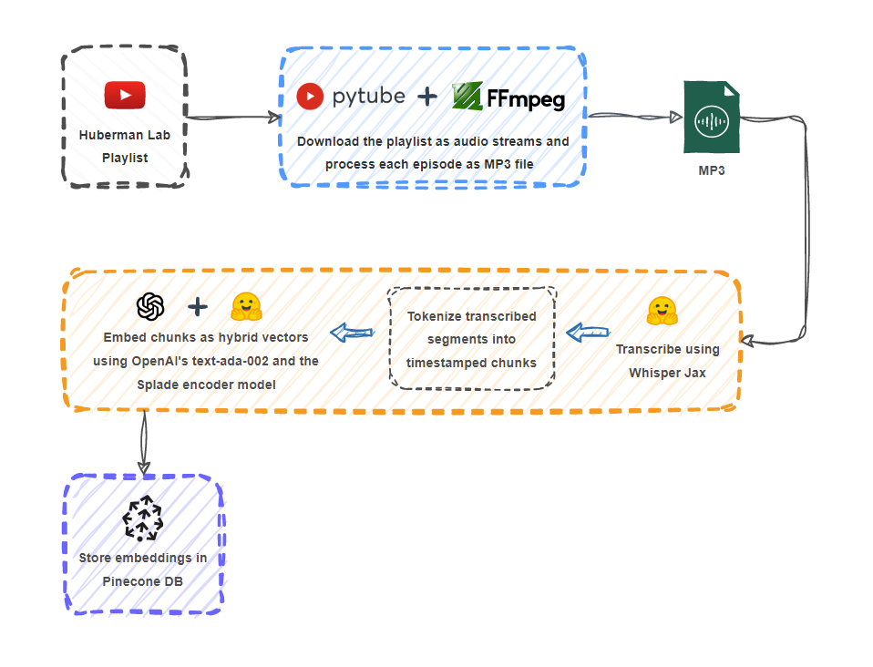
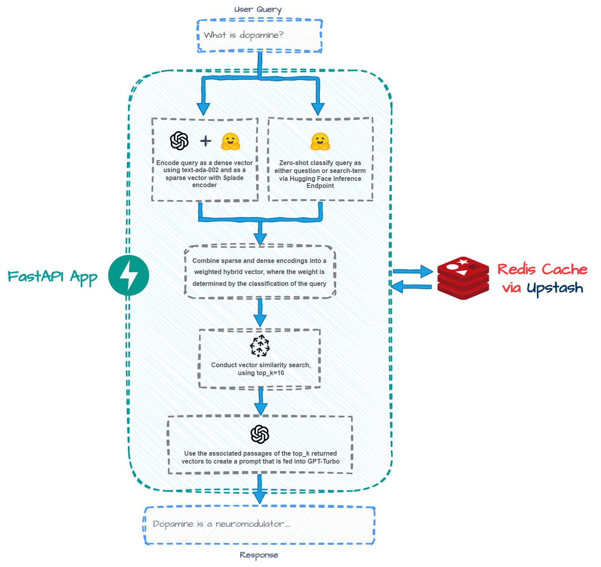
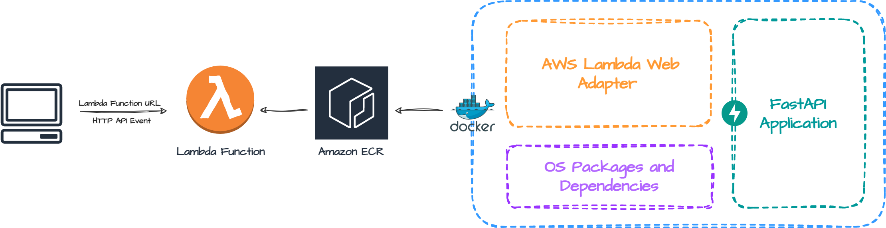

# hubermanGPT

Welcome to hubermangpt! This is a simple semantic search and retrieval-augmented QA engine trained on episodes from the Huberman Lab podcast. Check out the application [here](https://hubermanlab-gpt-vue.vercel.app/).

This codebase is 100% open-source.

## Demo

## How It Works

### Pre-Inference

### At Inference Time

## Deployment to AWS

To run the FastAPI application on AWS Lambda, you have to make use of a Lambda extension called [Web Adapter](https://github.com/awslabs/aws-lambda-web-adapter/tree/main). 

[AWS SAM](https://docs.aws.amazon.com/serverless-application-model/latest/developerguide/what-is-sam.html) provides a nice toolkit that allowed me to easily package this extension and the FastAPI app as a Docker image, push to Amazon ECR, and deploy as a Lambda function, all done via two SAM CLI commands. You can check out the deployment of the backend [here](https://github.com/hbattu73/hubermanlab-gpt/tree/main).

The process creates a CloudFormation stack where I can easily configure my app's infrastructure in an simple manner. For example, I wanted to reduce the frequency of cold starts. So I created an EventBridge trigger that pings my FastAPI application for a healthcheck every minute or so, perpetually keeping the Lambda container warm, and reducing response latency.
